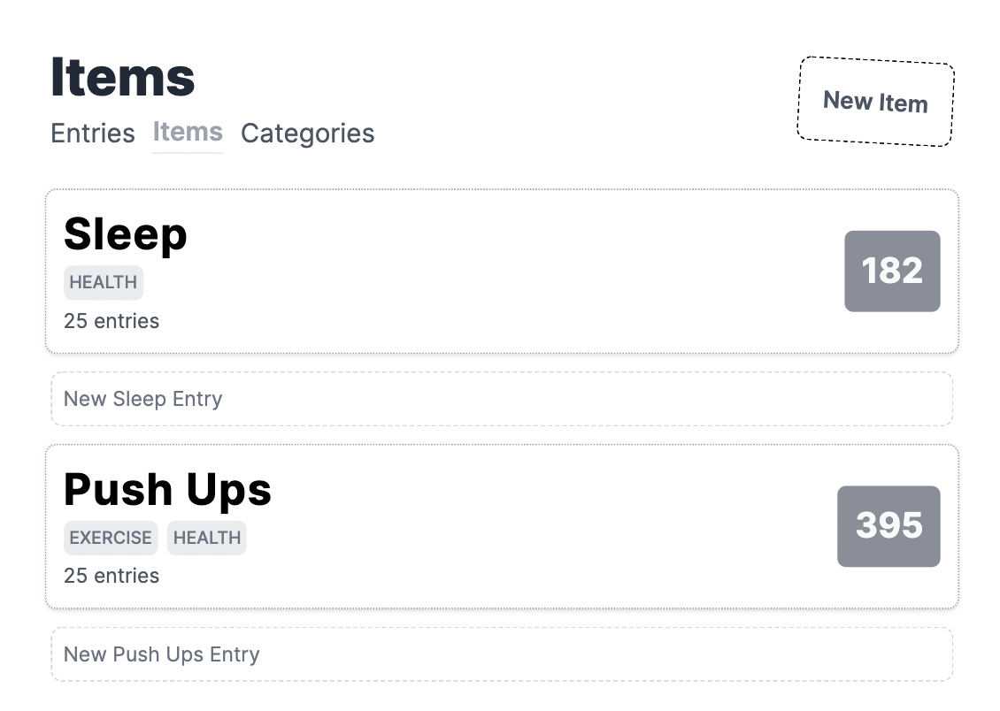

# Track Anything Tool

## Overview

A simple "Track Anything" tool that allows you to create and monitor various items over time.

### Key Features

- Create new "things to track"
- Enter updated values with timestamps
- Track progress over time
- User-friendly interface

## How It Works

1. You create a new item to track
2. Enter updated values when appropriate
3. We store it with a timestamp
4. Help you visualize and track progress over time

## Screenshots

1. Categories Overview
2. Items List
3. New Entry Form
4. Entries Display
5. Category Page
6. Item Page

## Technologies Used

- Ruby on Rails
- HTML/ERB
- CSS (Tailwind CSS)

